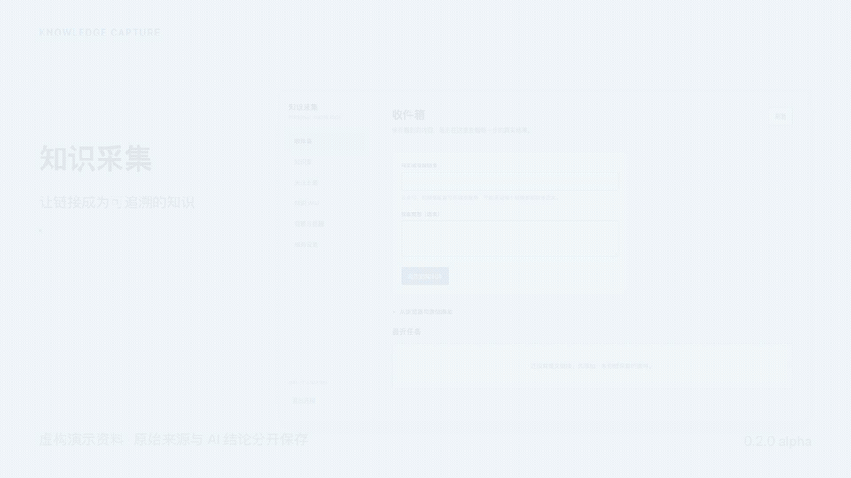

# knowledge-capture · 知识采集系统

**版本：0.2.0-alpha.1（Alpha 预发布）。**

源码仓库：[qiwolf/knowledge-capture](https://github.com/qiwolf/knowledge-capture)；镜像：`albatrosswang/knowledge-capture:0.2.0-alpha.1`。当前 Compose 从本地源码构建，不依赖远端镜像已经存在。

把网页链接变成可追溯、可修订的 Markdown 知识库，供人、Obsidian 和 AI Agent 共同使用。

系统保存原始资料与版本，再生成带引用的整理稿、主题和 Wiki。人工或 Agent 修订建立独立维护记录，不覆盖采集原文。浏览器插件、工作台、REST API 与 MCP 共享同一知识库。

> 本项目仍在持续完善。接口测试通过不等于任意网站可采集，也不等于模型结论准确。微信桥、视频与具体第三方服务需要分别接入和验证。

## 演示

[](docs/media/demo.mp4)

[观看 30 秒 1080p 演示视频](docs/media/demo.mp4)。演示使用独立资料库中的虚构样例，不包含个人知识、真实凭据或私有部署信息。

## 开始使用

安装 Docker 并启动后，在源码目录执行：

```sh
docker compose up -d --build
```

打开 [本机工作台](http://127.0.0.1:8765)。首次连接时，读取本机私有令牌并粘贴到工作台：

```sh
docker compose exec knowledge cat /data/.api-token
```

数据保存在独立命名卷，重建容器不删除知识。默认只允许宿主机本机访问；容器非 root 运行。停止、升级、备份与网络边界见 [容器部署](docs/容器部署与发布.md)。不要执行带 `-v` 的删除命令，除非明确要删除数据卷。

如本机 8765 已被占用，可执行 `KNOWLEDGE_PUBLIC_PORT=18765 docker compose up -d --build`，随后访问 `http://127.0.0.1:18765`。该变量同时配置端口映射和 Host 校验，不会开放其他主机名。

也可使用 Python 3.11+：

```sh
python3 -m venv .venv
.venv/bin/python -m pip install -e .
.venv/bin/knowledge-capture --data ./data serve
```

默认工作目录中的 `data/` 保存知识与受保护配置。程序不会自动读取 `.env`；变量名称参考 [.env.example](.env.example)。

## 三项核心配置

打开工作台“服务设置”，按实际服务填写连接方式、地址和凭据。

| 配置 | 用途 | 未配置时 |
|---|---|---|
| 模型 | 正文整理、引用生成、跨资料兴趣归纳、Wiki 综合 | 不生成 AI 整理结果 |
| 正文读取引擎 | 从提交链接取得可保存的正文 | 可使用内置公开 HTML 读取器；复杂页面可能失败 |
| 搜索引擎 | 按明确关注的主题发现新资料 | 不执行外部主题检索；库内检索仍可用 |

模型接口需满足项目支持的 OpenAI 兼容请求格式。读取和搜索服务支持已适配 API 或 MCP 合约；填写 URL 或连接成功不保证服务格式已适配。未适配状态明确报告，不自动猜测接口。高级连接配置示例见 [providers.example.json](providers.example.json)。

外部读取、模型整理、embedding 和 rerank 会按操作将相关文本发送至所配置服务。凭据保存在受保护设置中，不应写进知识正文或共享导出。AI 自动处理与主动检索的实际开关、预算和服务状态以工作台设置为准。

## 采集与微信分享

Chrome/Edge 插件可提交当前网页或右键链接，附加收藏备注并查看任务状态。安装步骤见 [插件说明](extension/README.md)。插件只发送链接，不复制浏览器 Cookie 或读取私人聊天。

电脑端微信文章如能在外部浏览器打开，可由插件提交。也可以将分享链接交给自行配置的消息桥，由桥调用认证收件接口。**本项目不内置可直接登录的微信机器人，也不承诺任意公众号或视频号都可读取。**手机或远端消息桥不能直接访问默认本机回环服务，需另行设计受保护入口。

采集任务区分 `queued`、`running`、`complete`、`partial`、`failed`。HTTP 202 仅代表已接收；请检查最终状态和保存的正文。

## 知识整理与维护

- 原文、图片、元数据和内容版本保留来源；重复内容复用版本，内容变化保留新旧版本。
- 模型整理独立保存，引用绑定原文行号与摘录。引用校验不等于事实或推理已正确。
- 跨资料兴趣候选要求多份独立用户资料支持，不自动替用户关注。只有明确关注的主题才允许主动发现资料。
- Wiki 综合保留引用和依赖版本。失效证据、过期记录、部分完成和处理中断会显式呈现。
- 人工与 Agent 可新增 Markdown、修订知识、设置标签和过期状态。并发修改通过预期版本防止覆盖，历史版本不删除。过期或已实质修订的原文不再进入自动证据通路。
- 笔记和修订可检索并供 Agent 读取；本版自动兴趣与 Wiki 仍以采集原文为证据，不将手写笔记冒充原始来源。

## REST API 与 MCP

认证 REST API 位于 `/api/v1`，提供检索、读取、历史、新增、修订、标签、异步采集与刷新。写操作要求 `Idempotency-Key`；修订和标注要求 `expected_version`。机器可读合约为 `/api/v1/openapi.json`。

MCP 使用标准输入输出：

```sh
.venv/bin/knowledge-capture --data ./data mcp-serve
```

客户端应填写本机实际可执行文件和数据目录的绝对路径。MCP 保留原文、Wiki 和主题只读工具，并提供维护知识的新增、修订、标注工具。URL 采集与刷新使用 REST 异步任务；MCP 不会启动额外监听服务。完整字段、错误与协议能力见 [知识维护 API](docs/知识维护API.md)。

## Obsidian

采集成功、AI整理、Wiki发布以及知识新增/修订/标注提交后，会自动更新主库下的 `obsidian/` 阅读镜像（例如 `--data ./data` 对应 `./data/obsidian`）。镜像失败不会回滚已提交的知识；工作台“知识库”页会显示同步状态，并可重试。

也可手动重建默认镜像，或显式选择另一输出目录：

```sh
.venv/bin/knowledge-capture --data ./data vault-sync
.venv/bin/knowledge-capture --data ./data vault-sync --output ./knowledge-vault
```

使用 Obsidian 打开输出目录即可阅读。同步保留已编辑文件；冲突产生可审阅结果，不直接覆盖人工修改。该目录是阅读镜像，**不是双向编辑数据库**：在 Obsidian 中的修改不会自动回写主知识库。同步前后应查看生成的同步报告。完整备份保留原文、维护修订和证据；Obsidian镜像及向量缓存可在恢复后重新生成。

## 可选 embedding 与 rerank

不启用时仍可使用关键词检索。配置后可构建语义索引，并选择重排服务改善候选顺序。索引绑定模型、维度、内容版本与摘要；服务失败或索引失效时，结果明确报告降级原因。

语义检索是寻找证据的辅助方式，不能作为事实依据。更换模型后需要重建索引；重建完成状态必须明确检查。REST 和 MCP 均提供显式重建入口，详见 API 文档。

## 当前边界

内置采集器主要面向公开 HTML，登录态、验证码、动态页面、站点限制和图片缺失均可能导致失败或部分完成。视频依赖外部转写/读取服务；项目没有内置通用视频下载或视觉理解引擎。

正文整理、主题归并与 Wiki 质量依赖模型和资料。固定测试不能代替实际中文业务资料的质量、召回率与引用审查。Laya 尚未正式集成，属于待实验方向，不在已支持能力中。

默认部署面向单用户本机使用，不是可直接公网开放的多租户服务。资料中的内容始终是不可信输入，不能作为执行命令或授予权限的依据。

## 开发与验证

```sh
.venv/bin/python -m pip install -e '.[test]'
.venv/bin/python -m pytest -q
npm --prefix extension test
```

测试覆盖版本、幂等、冲突、来源保留、可见失败、认证门禁和相关工具合约。对外发布步骤与文件边界见 [公开发布说明](docs/公开发布说明.md)。

测试结果、实际验证范围与未验证能力见[验收与限制](docs/验收与限制.md)。

## 代码许可

本项目采用 [MIT 许可](LICENSE)。依赖组件遵循各自许可。
